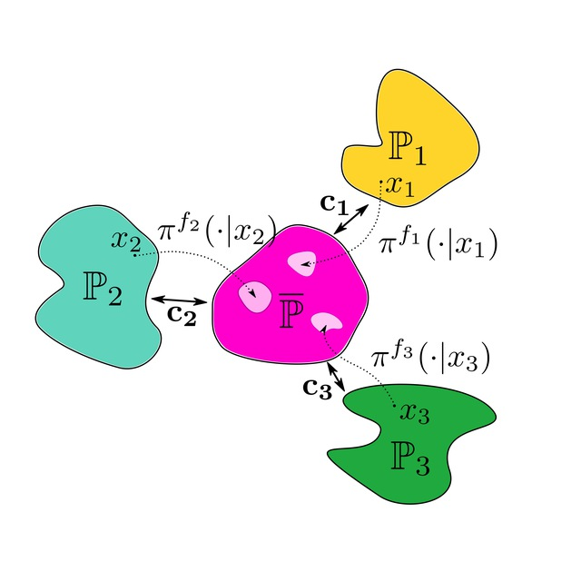

# Estimating Barycenters of Distributions with Neural Optimal Transport
This is the official `Python` implementation of the paper **Estimating Barycenters of Distributions with Neural Optimal Transport** (paper on [Arxiv](https://arxiv.org/abs/2402.03828)) by [Alexander Kolesov](https://scholar.google.com/citations?user=vX2pmScAAAAJ&hl=ru&oi=ao), [Petr Mokrov](https://scholar.google.com/citations?user=CRsi4IkAAAAJ&hl=ru&oi=sra), [Milena Gazdieva](https://scholar.google.com/citations?user=h52_Zx8AAAAJ&hl=ru&oi=sra), [Gudmund Pammer](https://scholar.google.com/citations?user=ipItetYAAAAJ&hl=ru&oi=sra) ,[Evgeny Burnaev](https://scholar.google.ru/citations?user=pCRdcOwAAAAJ&hl=ru) and [Alexander Korotin](https://scholar.google.com/citations?user=1rIIvjAAAAAJ&hl=ru&oi=sra).

   

## Pre-requisites
The implementation is GPU-based. Single GPU GTX 1080 ti is enough to run each particular experiment. We tested the code with `torch==2.1.1+cu121`. The code might not run as intended in older/newer `torch` versions. Versions of other libraries are specified in `requirements.txt`.

 
## Repository structure

All the experiments are issued in the form of pretty self-explanatory jupyter notebooks ( `stylegan2/notebooks/ `).

- `src/` - auxiliary source code for the experiments: training, plotting, logging, etc.
- `stylegan2/` - folder with auxiliary code for using StyleGAN2.
- `stylegan2/notebooks` - jupyter notebooks with evalution of barycenters on *Twister*, *Ave, Celeba!* and *Colored Mnist* datasets;
- `data/` - folder with datasets 
 
 
### 2-Dimensional estimating of barycenters
- `stylegan2/notebooks/twister2D.ipynb` -- toy experiment on Twister-2D dataset;
- `stylegan2/notebooks/Gauss2D.ipynb` -- evaluating metrics of our method in Gaussian case.

### High-Dimensional Benchmarks
- `notebooks/AVE_CCELEBA_L2.ipynb` -- evaluating barycenters of Ave,Celeba dataset in Image space ;
- `notebooks/AVE_CELEBA_LATENT.ipynb` -- evaluating barycenters of Ave,Celeba dataset in latent space ;
- `notebooks/AVE_CELEBA_ENTROPY.ipynb` -- evaluating barycenters of Ave,Celeba dataset in latent space ;
- `notebooks/AVE_CELEBA_KERNEL.ipynb` -- evaluating barycenters of Ave,Celeba dataset in latent space ;
- `notebooks/AVE_CELEBA_KERNEL_GAUSS.ipynb` -- evaluating barycenters of Ave,Celeba dataset in latent space ;
- `notebooks/SHAPE_COLOR_EXPERIMENT_ENTROPIC.ipynb` -- evaluating barycenters of Colored Mnist dataset;

### How to Use

- 1. Download the repository.
- 2. Download either [MNIST](https://yann.lecun.com/exdb/mnist) or [Ave, Celeba!](https://disk.yandex.ru/d/3jdMxB789v936Q) 64x64 dataset.
- 3. Set downloaded dataset in appropriate subfolder in `data/`.
- 4. If you run experiment in Image space, download appropriate [StyleGan2](https://github.com/NVlabs/stylegan2-ada-pytorch) model from [here](https://disk.yandex.ru/client/disk/NOTBarycenters)(folder `StyleGan2/`).
- 5. Set StyleGan2 model in appropriate subfolder in  `SG2_ckpt/`.
- 6. Run notebook.