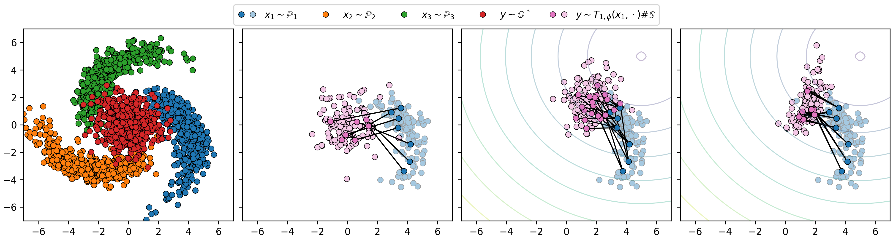
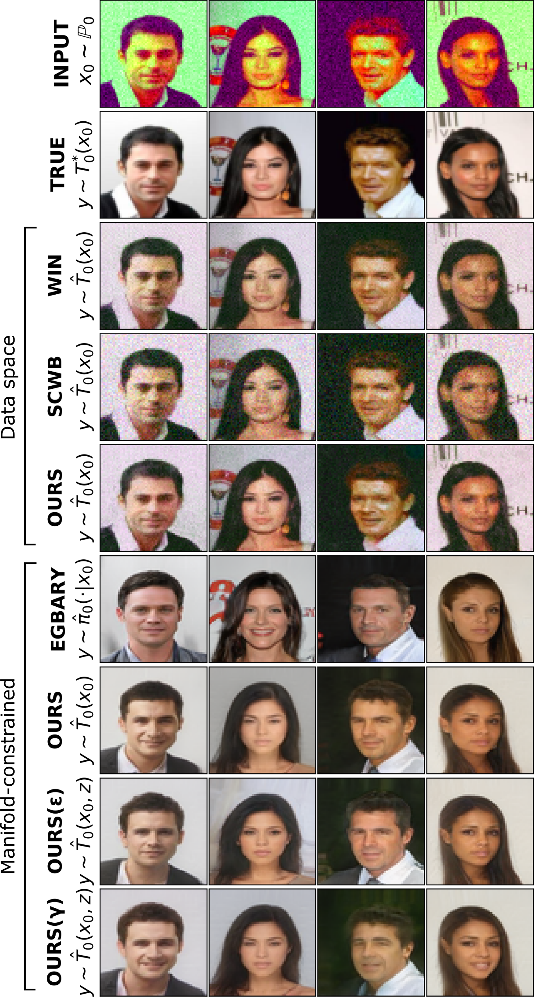
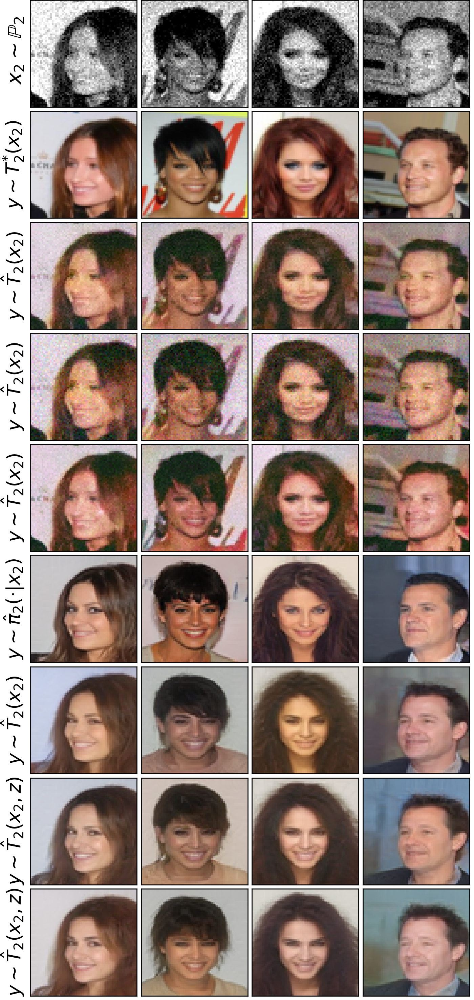
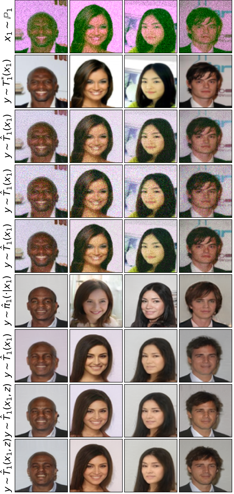
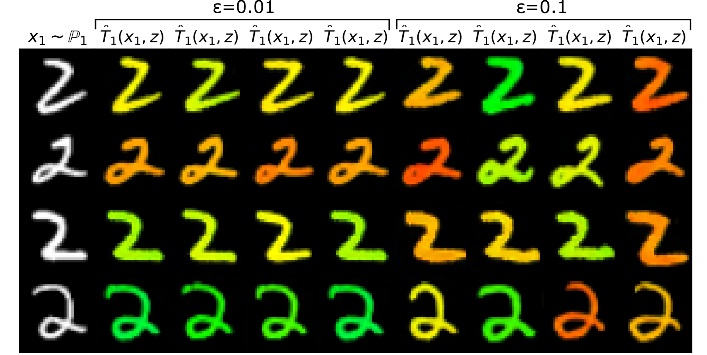
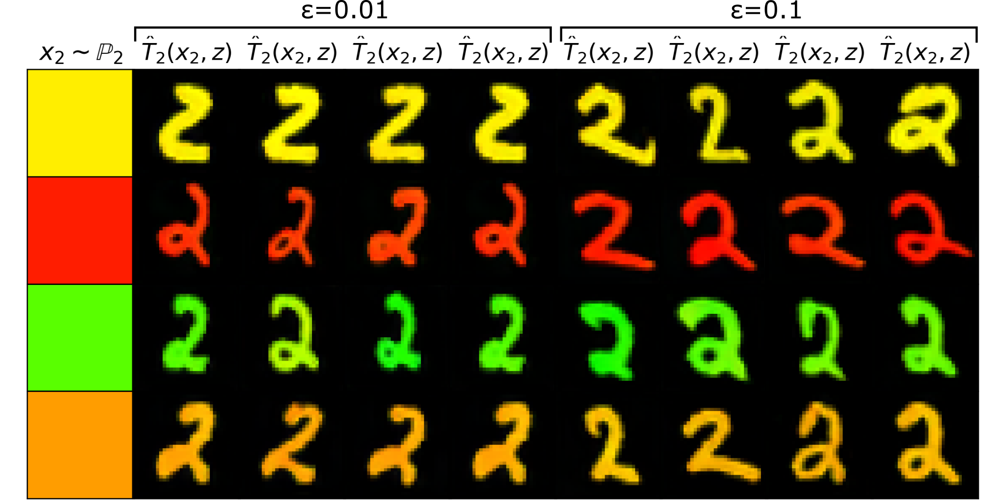

# Estimating Barycenters of Distributions with Neural Optimal Transport

This is the official `Python` implementation of the paper **Estimating Barycenters of Distributions with Neural Optimal Transport** (paper on [Arxiv](https://arxiv.org/abs/2402.03828)) by [Alexander Kolesov](https://scholar.google.com/citations?user=vX2pmScAAAAJ&hl=ru&oi=ao), [Petr Mokrov](https://scholar.google.com/citations?user=CRsi4IkAAAAJ&hl=ru&oi=sra), [Igor Udovichenko](https://scholar.google.com/citations?hl=ru&user=IkcYVhXfeQcC), [Milena Gazdieva](https://scholar.google.com/citations?user=h52_Zx8AAAAJ&hl=ru&oi=sra), [Gudmund Pammer](https://scholar.google.com/citations?user=ipItetYAAAAJ&hl=ru&oi=sra), [Evgeny Burnaev](https://scholar.google.ru/citations?user=pCRdcOwAAAAJ&hl=ru) and [Alexander Korotin](https://scholar.google.com/citations?user=1rIIvjAAAAAJ&hl=ru&oi=sra).

## Pre-requisites
The implementation is GPU-based. Single GPU GTX 1080 ti is enough to run each particular experiment. We tested the code with `torch==2.1.1+cu121`. The code might not run as intended in older/newer `torch` versions. Versions of other libraries are specified in `requirements.txt`. Pre-trained models for maps and potentials are located [here](https://disk.yandex.ru/client/disk/NOTBarycenters).

 
## Repository structure

All the experiments are issued in the form of pretty self-explanatory jupyter notebooks ( `stylegan2/notebooks/ `).

- `src/` - auxiliary source code for the experiments: training, plotting, logging, etc.
- `stylegan2/` - folder with auxiliary code for using StyleGAN2.
- `stylegan2/notebooks` - jupyter notebooks with evaluation of barycenters on 2D and Image datasets.
- `data/` - folder with datasets. 
- `SG2_ckpt/` - folder with checkpoints for [StyleGAN2](https://github.com/NVlabs/stylegan2-ada-pytorch) models.
 
### 2-Dimensional estimating barycenters

- `stylegan2/notebooks/twister2D.ipynb` -- toy experiments on 2D Twister dataset.
- `stylegan2/notebooks/Gauss2D.ipynb` -- evaluating metrics of our method in Gaussian case.

### High-Dimensional estimating barycenters of Ave,Celeba! dataset

- `notebooks/AVE_CELEBA_L2.ipynb` -- estimating barycenters of **Ave,Celeba** dataset in Image space ;
- `notebooks/AVE_CELEBA_LATENT.ipynb` --  estimating barycenters in latent space with classical cost;
- `notebooks/AVE_CELEBA_ENTROPY.ipynb` -- estimating barycenters in latent space with $\epsilon$-KL cost ;
- `notebooks/AVE_CELEBA_KERNEL.ipynb` --  estimating barycenters in latent space with $\gamma$-Energy cost;
- `notebooks/AVE_CELEBA_KERNEL_GAUSS.ipynb` -- estimating barycenters in latent space with $\gamma$-Energy cost(Gaussian reparam.);

  
    
   

### High-Dimensional estimating barycenters of Colored MNIST dataset

- `notebooks/SHAPE_COLOR_EXPERIMENT_ENTROPIC.ipynb` -- estimating barycenters in latent space with $\epsilon$-KL cost;

  
   

## How to Use

- Download the repository.
- Download either [MNIST](https://yann.lecun.com/exdb/mnist) or [Ave, Celeba!](https://disk.yandex.ru/d/3jdMxB789v936Q) 64x64 dataset.
- Set downloaded dataset in appropriate subfolder in `data/`.
- If you run experiment in Image space, download appropriate [StyleGan2](https://github.com/NVlabs/stylegan2-ada-pytorch) model from [here](https://disk.yandex.ru/client/disk/NOTBarycenters)(folder `StyleGan2/`).
- Set StyleGan2 model in appropriate subfolder in `SG2_ckpt/`.
- Run notebook for training or take appropriate checkpoint from [here](https://disk.yandex.ru/client/disk/NOTBarycenters).

## Credits

- [Ave,Celeba](https://disk.yandex.ru/d/3jdMxB789v936Q) with faces dataset;
- [MNIST](https://yann.lecun.com/exdb/mnist) with images dataset.
- [UNet architecture](https://github.com/milesial/Pytorch-UNet) for maps in Image spaces;
- [ResNet architectures](https://github.com/harryliew/WGAN-QC) for maps in latent spaces;